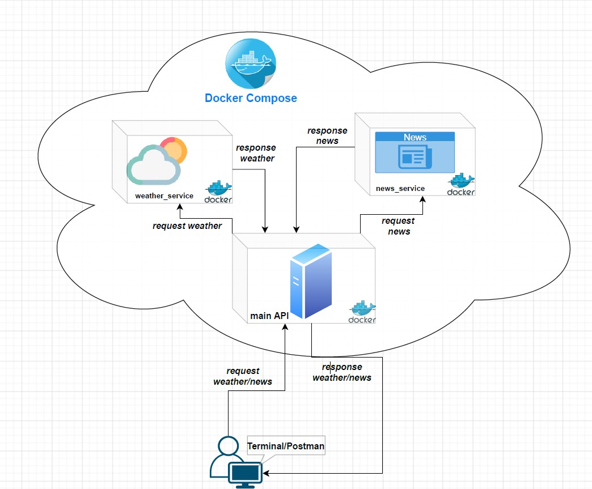

# python_service

- Install Docker Engine & Docker Compose
```
  $ sudo apt-get update
  $ sudo apt-get install docker-ce docker-ce-cli containerd.io

  $ sudo curl -L "https://github.com/docker/compose/releases/download/1.28.2/docker-compose-$(uname -s)-$(uname -m)" -o /usr/local/bin/docker-compose
  $ sudo chmod +x /usr/local/bin/docker-compose
```
### Docker
```
- Start the Docker daemon (if needed)
  $ sudo systemctl start docker.

docker-compose up --build (to run)

docker-compose down (to kill and stop docker images)

docker-compose up --build --scale (a_service=x) (to create multiple instances of a service)
```

- Sample http requests
```
curl -XGET "localhost:3001/weather?city=athens"
curl -XGET "localhost:3001/news?country=gb"
```
- To run client_weather_news_app.py
```
  source bin/activate (Activate virtual env)

  pip install -r requirements.txt (Install Dependencies)
```

- Architecture Overview
```

```